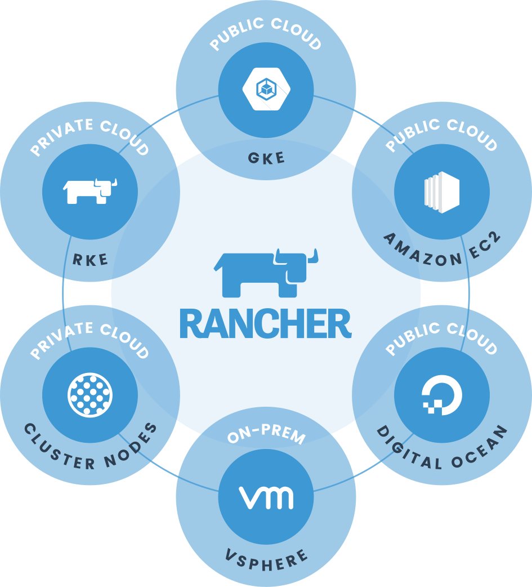
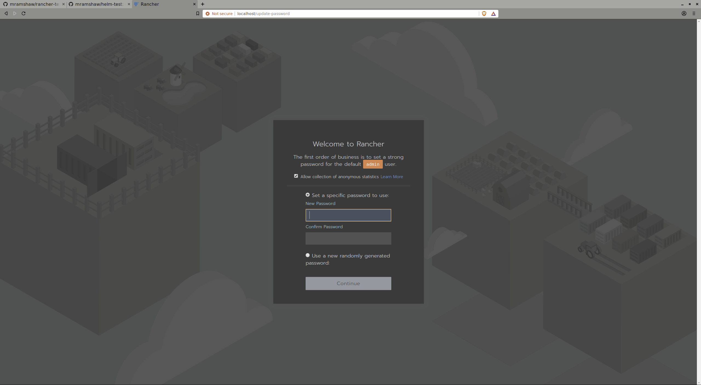
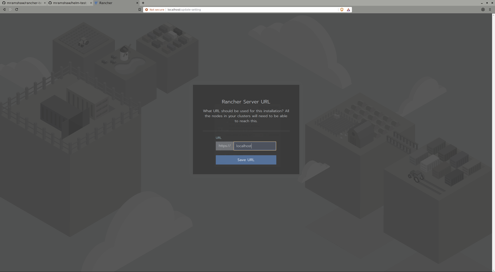
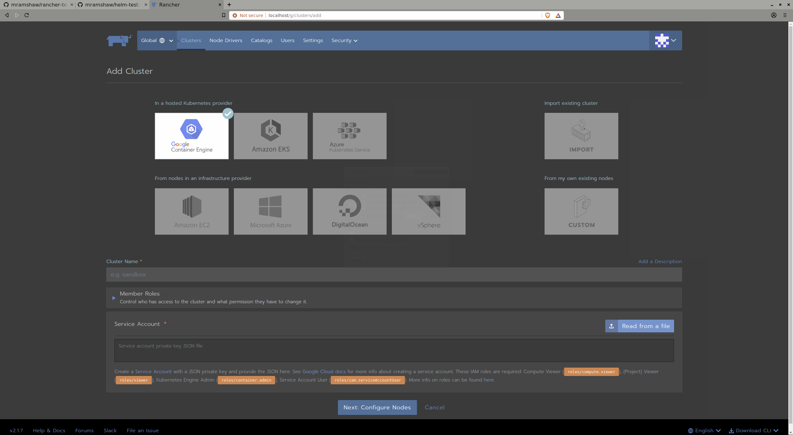
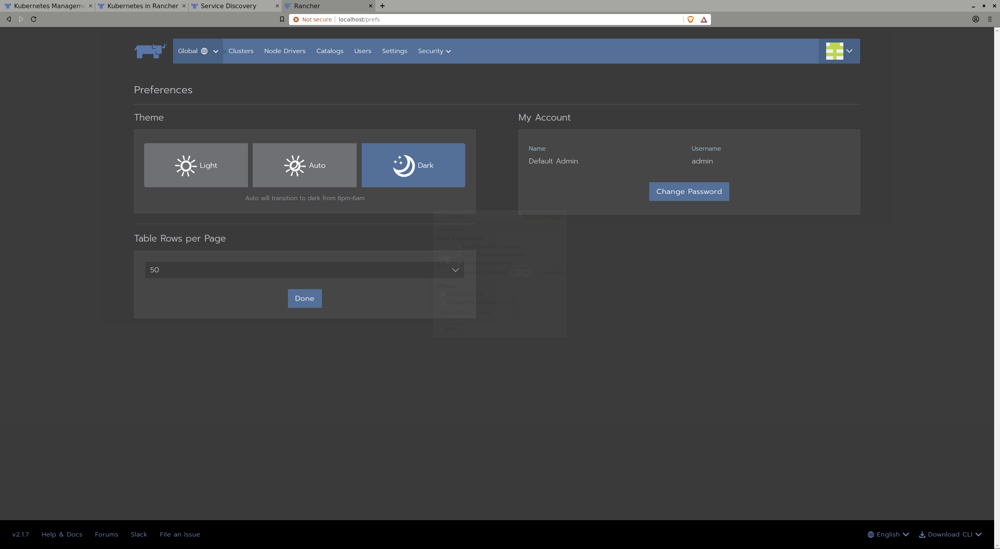

# rancher-test



Getting familiar with Rancher

[In addition to the providers listed above, Rancher also supports Microsoft Azure (both via VMs and Azure Kubernetes Service).]

## Motivation

[Rancher](http://rancher.com/) offers a nice GUI for Multi-Cluster Kubernetes Management.

This is an option for anyone who does not wish to use `helm`.

Of course, under the covers Rancher actually uses `helm` itself, but sometimes a graphical user interface is handy.

Rancher also offers a CLI tool.

## Run with Docker

As it's possible to run Rancher with Docker, we will start with that.

First we will launch the Docker container, then we will configure some options.

#### Docker Run

```bash
$ docker run --name helm_rancher --restart=unless-stopped -p 80:80 -p 443:443 rancher/rancher
Unable to find image 'rancher/rancher:latest' locally
latest: Pulling from rancher/rancher
6cf436f81810: Pull complete 
987088a85b96: Pull complete 
b4624b3efe06: Pull complete 
d42beb8ded59: Pull complete 
20428076f45c: Pull complete 
aa5f6ec4068f: Pull complete 
fa0b81e2aefe: Pull complete 
174adca119fa: Pull complete 
b36e95625791: Pull complete 
3b4599da8bc5: Pull complete 
7c3eae4ec924: Pull complete 
821c0eae95fd: Pull complete 
Digest: sha256:1943e9b7d802992d3c61184af7ae2ca5d414c15152bc40ec995e71e28cb80844
Status: Downloaded newer image for rancher/rancher:latest
2019/03/21 16:51:05 [INFO] Rancher version v2.1.7 is starting
2019/03/21 16:51:05 [INFO] Rancher arguments {ACMEDomains:[] AddLocal:auto Embedded:false KubeConfig: HTTPListenPort:80 HTTPSListenPort:443 K8sMode:auto Debug:false NoCACerts:false ListenConfig:<nil> AuditLogPath:/var/log/auditlog/rancher-api-audit.log AuditLogMaxage:10 AuditLogMaxsize:100 AuditLogMaxbackup:10 AuditLevel:0}
2019/03/21 16:51:05 [INFO] Listening on /tmp/log.sock
2019/03/21 16:51:05 [INFO] [certificates] Generating CA kubernetes certificates
2019/03/21 16:51:05 [INFO] [certificates] Generating Kubernetes API server certificates
2019/03/21 16:51:05 [INFO] [certificates] Generating Kube Controller certificates
2019/03/21 16:51:06 [INFO] [certificates] Generating Kube Scheduler certificates
2019/03/21 16:51:06 [INFO] [certificates] Generating Kube Proxy certificates
2019/03/21 16:51:06 [INFO] [certificates] Generating Node certificate
2019/03/21 16:51:06 [INFO] [certificates] Generating admin certificates and kubeconfig
2019/03/21 16:51:06 [INFO] [certificates] Generating etcd-127.0.0.1 certificate and key
2019/03/21 16:51:06 [INFO] [certificates] Generating Kubernetes API server aggregation layer requestheader client CA certificates
2019/03/21 16:51:07 [INFO] [certificates] Generating Kubernetes API server proxy client certificates
2019/03/21 16:51:07 [INFO] Running etcd --peer-client-cert-auth --client-cert-auth --listen-client-urls=https://0.0.0.0:2379 --initial-cluster=etcd-master=https://127.0.0.1:2380 --peer-trusted-ca-file=/etc/kubernetes/ssl/kube-ca.pem --election-timeout=5000 --data-dir=/var/lib/rancher/etcd/ --initial-cluster-token=etcd-cluster-1 --listen-peer-urls=https://0.0.0.0:2380 --initial-cluster-state=new --cert-file=/etc/kubernetes/ssl/kube-etcd-127-0-0-1.pem --peer-cert-file=/etc/kubernetes/ssl/kube-etcd-127-0-0-1.pem --peer-key-file=/etc/kubernetes/ssl/kube-etcd-127-0-0-1-key.pem --heartbeat-interval=500 --advertise-client-urls=https://127.0.0.1:2379,https://127.0.0.1:4001 --initial-advertise-peer-urls=https://127.0.0.1:2380 --trusted-ca-file=/etc/kubernetes/ssl/kube-ca.pem --name=etcd-master --key-file=/etc/kubernetes/ssl/kube-etcd-127-0-0-1-key.pem
2019-03-21 16:51:07.640267 I | etcdmain: etcd Version: 3.2.13
2019-03-21 16:51:07.640277 I | etcdmain: Git SHA: Not provided (use ./build instead of go build)
2019-03-21 16:51:07.640280 I | etcdmain: Go Version: go1.11
2019-03-21 16:51:07.640282 I | etcdmain: Go OS/Arch: linux/amd64
2019-03-21 16:51:07.640285 I | etcdmain: setting maximum number of CPUs to 8, total number of available CPUs is 8
2019-03-21 16:51:07.640330 I | embed: peerTLS: cert = /etc/kubernetes/ssl/kube-etcd-127-0-0-1.pem, key = /etc/kubernetes/ssl/kube-etcd-127-0-0-1-key.pem, ca = , trusted-ca = /etc/kubernetes/ssl/kube-ca.pem, client-cert-auth = true
2019-03-21 16:51:07.640658 I | embed: listening for peers on https://0.0.0.0:2380
2019-03-21 16:51:07.640681 I | embed: listening for client requests on 0.0.0.0:2379
2019-03-21 16:51:07.643729 I | etcdserver: name = etcd-master
2019-03-21 16:51:07.643737 I | etcdserver: data dir = /var/lib/rancher/etcd/
2019-03-21 16:51:07.643741 I | etcdserver: member dir = /var/lib/rancher/etcd/member
2019-03-21 16:51:07.643744 I | etcdserver: heartbeat = 500ms
2019-03-21 16:51:07.643747 I | etcdserver: election = 5000ms
2019-03-21 16:51:07.643750 I | etcdserver: snapshot count = 100000
2019-03-21 16:51:07.643756 I | etcdserver: advertise client URLs = https://127.0.0.1:2379,https://127.0.0.1:4001
2019-03-21 16:51:07.643760 I | etcdserver: initial advertise peer URLs = https://127.0.0.1:2380
2019-03-21 16:51:07.643765 I | etcdserver: initial cluster = etcd-master=https://127.0.0.1:2380
2019-03-21 16:51:07.646429 I | etcdserver: starting member e92d66acd89ecf29 in cluster 7581d6eb2d25405b
2019-03-21 16:51:07.646449 I | raft: e92d66acd89ecf29 became follower at term 0
2019-03-21 16:51:07.646455 I | raft: newRaft e92d66acd89ecf29 [peers: [], term: 0, commit: 0, applied: 0, lastindex: 0, lastterm: 0]
2019-03-21 16:51:07.646459 I | raft: e92d66acd89ecf29 became follower at term 1
2019-03-21 16:51:07.651739 W | auth: simple token is not cryptographically signed
2019-03-21 16:51:07.653591 I | etcdserver: starting server... [version: 3.2.13, cluster version: to_be_decided]
2019-03-21 16:51:07.653977 I | embed: ClientTLS: cert = /etc/kubernetes/ssl/kube-etcd-127-0-0-1.pem, key = /etc/kubernetes/ssl/kube-etcd-127-0-0-1-key.pem, ca = , trusted-ca = /etc/kubernetes/ssl/kube-ca.pem, client-cert-auth = true
2019-03-21 16:51:07.654092 I | etcdserver/membership: added member e92d66acd89ecf29 [https://127.0.0.1:2380] to cluster 7581d6eb2d25405b
2019-03-21 16:51:12.646637 I | raft: e92d66acd89ecf29 is starting a new election at term 1
2019-03-21 16:51:12.646674 I | raft: e92d66acd89ecf29 became candidate at term 2
2019-03-21 16:51:12.646695 I | raft: e92d66acd89ecf29 received MsgVoteResp from e92d66acd89ecf29 at term 2
2019-03-21 16:51:12.646708 I | raft: e92d66acd89ecf29 became leader at term 2
2019-03-21 16:51:12.646713 I | raft: raft.node: e92d66acd89ecf29 elected leader e92d66acd89ecf29 at term 2
2019-03-21 16:51:12.646910 I | etcdserver: published {Name:etcd-master ClientURLs:[https://127.0.0.1:2379 https://127.0.0.1:4001]} to cluster 7581d6eb2d25405b
2019-03-21 16:51:12.646948 I | embed: ready to serve client requests
2019-03-21 16:51:12.647033 I | etcdserver: setting up the initial cluster version to 3.2
2019-03-21 16:51:12.647092 I | embed: serving client requests on [::]:2379
2019-03-21 16:51:12.649069 N | etcdserver/membership: set the initial cluster version to 3.2
2019-03-21 16:51:12.649125 I | etcdserver/api: enabled capabilities for version 3.2
2019/03/21 16:51:12 [INFO] Running kube-apiserver --tls-cipher-suites=TLS_ECDHE_ECDSA_WITH_AES_128_GCM_SHA256,TLS_ECDHE_ECDSA_WITH_AES_256_GCM_SHA384,TLS_ECDHE_ECDSA_WITH_CHACHA20_POLY1305,TLS_ECDHE_RSA_WITH_AES_128_GCM_SHA256,TLS_ECDHE_RSA_WITH_AES_256_GCM_SHA384,TLS_ECDHE_RSA_WITH_CHACHA20_POLY1305 --requestheader-allowed-names= --etcd-keyfile=/etc/kubernetes/ssl/kube-node-key.pem --etcd-prefix=/registry --requestheader-client-ca-file= --proxy-client-cert-file= --requestheader-group-headers= --proxy-client-key-file= --tls-private-key-file=/etc/kubernetes/ssl/kube-apiserver-key.pem --kubelet-client-certificate=/etc/kubernetes/ssl/kube-apiserver.pem --service-account-key-file=/etc/kubernetes/ssl/kube-apiserver-key.pem --etcd-certfile=/etc/kubernetes/ssl/kube-node.pem --etcd-servers=https://127.0.0.1:2379 --insecure-bind-address=127.0.0.1 --bind-address=127.0.0.1 --secure-port=6443 --tls-cert-file=/etc/kubernetes/ssl/kube-apiserver.pem --enable-admission-plugins=NamespaceLifecycle,LimitRanger,ServiceAccount,DefaultStorageClass,DefaultTolerationSeconds,MutatingAdmissionWebhook,ValidatingAdmissionWebhook,ResourceQuota --service-node-port-range=30000-32767 --storage-backend=etcd3 --cloud-provider= --service-cluster-ip-range=10.43.0.0/16 --client-ca-file=/etc/kubernetes/ssl/kube-ca.pem --endpoint-reconciler-type=lease --insecure-port=0 --kubelet-preferred-address-types=InternalIP,ExternalIP,Hostname --requestheader-username-headers= --authorization-mode=Node,RBAC --advertise-address=10.43.0.1 --allow-privileged=true --requestheader-extra-headers-prefix= --kubelet-client-key=/etc/kubernetes/ssl/kube-apiserver-key.pem --etcd-cafile=/etc/kubernetes/ssl/kube-ca.pem -v=1 --logtostderr=false --alsologtostderr=false
2019/03/21 16:51:12 [INFO] Activating driver gke
2019/03/21 16:51:12 [INFO] Activating driver gke done
2019/03/21 16:51:12 [INFO] Activating driver aks
2019/03/21 16:51:12 [INFO] Activating driver aks done
2019/03/21 16:51:12 [INFO] Activating driver eks
2019/03/21 16:51:12 [INFO] Activating driver eks done
2019/03/21 16:51:12 [INFO] Activating driver import
2019/03/21 16:51:12 [INFO] Activating driver import done
2019/03/21 16:51:12 [INFO] Activating driver rke
2019/03/21 16:51:12 [INFO] Activating driver rke done
[restful] 2019/03/21 16:51:15 log.go:33: [restful/swagger] listing is available at https://10.43.0.1:6443/swaggerapi
[restful] 2019/03/21 16:51:15 log.go:33: [restful/swagger] https://10.43.0.1:6443/swaggerui/ is mapped to folder /swagger-ui/
[restful] 2019/03/21 16:51:16 log.go:33: [restful/swagger] listing is available at https://10.43.0.1:6443/swaggerapi
[restful] 2019/03/21 16:51:16 log.go:33: [restful/swagger] https://10.43.0.1:6443/swaggerui/ is mapped to folder /swagger-ui/
2019/03/21 16:51:18 [INFO] Running kube-controller-manager --kubeconfig=/etc/kubernetes/ssl/kubecfg-kube-controller-manager.yaml --service-cluster-ip-range=10.43.0.0/16 --allow-untagged-cloud=true --cloud-provider= --v=2 --configure-cloud-routes=false --pod-eviction-timeout=5m0s --cluster-cidr=10.42.0.0/16 --service-account-private-key-file=/etc/kubernetes/ssl/kube-apiserver-key.pem --enable-hostpath-provisioner=false --node-monitor-grace-period=40s --allocate-node-cidrs=true --root-ca-file=/etc/kubernetes/ssl/kube-ca.pem --address=0.0.0.0 --leader-elect=true --use-service-account-credentials=true -v=1 --logtostderr=false --alsologtostderr=false --controllers * --controllers -resourcequota --controllers -service
2019/03/21 16:51:19 [INFO] Running in single server mode, will not peer connections
2019/03/21 16:51:19 [INFO] Creating CRD authconfigs.management.cattle.io
2019/03/21 16:51:19 [INFO] Creating CRD apps.project.cattle.io
2019/03/21 16:51:19 [INFO] Creating CRD apprevisions.project.cattle.io
2019/03/21 16:51:19 [INFO] Creating CRD catalogs.management.cattle.io
2019/03/21 16:51:19 [INFO] Creating CRD pipelineexecutions.project.cattle.io
2019/03/21 16:51:19 [INFO] Creating CRD clusteralerts.management.cattle.io
2019/03/21 16:51:19 [INFO] Creating CRD pipelinesettings.project.cattle.io
2019/03/21 16:51:19 [INFO] Creating CRD clusterevents.management.cattle.io
2019/03/21 16:51:19 [INFO] Creating CRD pipelines.project.cattle.io
2019/03/21 16:51:19 [INFO] Creating CRD clusterloggings.management.cattle.io
2019/03/21 16:51:19 [INFO] Creating CRD sourcecodecredentials.project.cattle.io
2019/03/21 16:51:19 [INFO] Creating CRD clusterregistrationtokens.management.cattle.io
2019/03/21 16:51:19 [INFO] Creating CRD sourcecodeproviderconfigs.project.cattle.io
E0321 16:51:19.689283       6 leaderelection.go:270] error retrieving resource lock kube-system/kube-controller-manager: endpoints "kube-controller-manager" is forbidden: User "system:kube-controller-manager" cannot get resource "endpoints" in API group "" in the namespace "kube-system"
2019/03/21 16:51:19 [INFO] Creating CRD clusterroletemplatebindings.management.cattle.io
2019/03/21 16:51:20 [INFO] Creating CRD sourcecoderepositories.project.cattle.io
2019/03/21 16:51:20 [INFO] Creating CRD clusters.management.cattle.io
2019/03/21 16:51:20 [INFO] Creating CRD composeconfigs.management.cattle.io
2019/03/21 16:51:21 [INFO] Creating CRD dynamicschemas.management.cattle.io
2019/03/21 16:51:21 [INFO] Creating CRD globalrolebindings.management.cattle.io
2019/03/21 16:51:21 [INFO] Creating CRD globalroles.management.cattle.io
2019/03/21 16:51:21 [INFO] Creating CRD groupmembers.management.cattle.io
2019/03/21 16:51:21 [INFO] Creating CRD groups.management.cattle.io
2019/03/21 16:51:22 [INFO] Creating CRD listenconfigs.management.cattle.io
2019/03/21 16:51:22 [INFO] Creating CRD nodedrivers.management.cattle.io
2019/03/21 16:51:22 [INFO] Creating CRD nodepools.management.cattle.io
2019/03/21 16:51:22 [INFO] Creating CRD nodetemplates.management.cattle.io
2019/03/21 16:51:22 [INFO] Creating CRD nodes.management.cattle.io
2019/03/21 16:51:23 [INFO] Creating CRD notifiers.management.cattle.io
2019/03/21 16:51:23 [INFO] Creating CRD podsecuritypolicytemplateprojectbindings.management.cattle.io
2019/03/21 16:51:23 [INFO] Creating CRD podsecuritypolicytemplates.management.cattle.io
2019/03/21 16:51:23 [INFO] Creating CRD preferences.management.cattle.io
2019/03/21 16:51:23 [INFO] Creating CRD projectalerts.management.cattle.io
2019/03/21 16:51:24 [INFO] Creating CRD projectloggings.management.cattle.io
2019/03/21 16:51:24 [INFO] Creating CRD projectnetworkpolicies.management.cattle.io
2019/03/21 16:51:24 [INFO] Creating CRD projectroletemplatebindings.management.cattle.io
2019/03/21 16:51:24 [INFO] Creating CRD projects.management.cattle.io
2019/03/21 16:51:24 [INFO] Creating CRD roletemplates.management.cattle.io
2019/03/21 16:51:25 [INFO] Creating CRD settings.management.cattle.io
2019/03/21 16:51:25 [INFO] Creating CRD templatecontents.management.cattle.io
2019/03/21 16:51:25 [INFO] Creating CRD templates.management.cattle.io
2019/03/21 16:51:25 [INFO] Creating CRD templateversions.management.cattle.io
2019/03/21 16:51:25 [INFO] Creating CRD tokens.management.cattle.io
2019/03/21 16:51:26 [INFO] Creating CRD userattributes.management.cattle.io
2019/03/21 16:51:26 [INFO] Creating CRD users.management.cattle.io
2019/03/21 16:51:26 [INFO] Starting API controllers
2019/03/21 16:51:26 [INFO] Starting catalog controller
2019/03/21 16:51:26 [INFO] Starting management controllers
2019/03/21 16:51:27 [INFO] Reconciling GlobalRoles
2019/03/21 16:51:27 [INFO] Listening on :443
2019/03/21 16:51:27 [INFO] Listening on :80
2019/03/21 16:51:27 [INFO] Creating user-base
2019/03/21 16:51:27 [INFO] Creating nodedrivers-manage
2019/03/21 16:51:27 [INFO] Creating catalogs-use
2019/03/21 16:51:27 [INFO] [mgmt-auth-gr-controller] Creating clusterRole cattle-globalrole-user-base for corresponding GlobalRole
2019/03/21 16:51:27 [INFO] Creating users-manage
2019/03/21 16:51:27 [INFO] [mgmt-auth-gr-controller] Creating clusterRole cattle-globalrole-nodedrivers-manage for corresponding GlobalRole
2019/03/21 16:51:27 [INFO] [mgmt-auth-gr-controller] Creating clusterRole cattle-globalrole-catalogs-use for corresponding GlobalRole
2019/03/21 16:51:27 [INFO] Creating authn-manage
2019/03/21 16:51:27 [INFO] [mgmt-auth-gr-controller] Creating clusterRole cattle-globalrole-users-manage for corresponding GlobalRole
2019/03/21 16:51:27 [INFO] Creating settings-manage
2019/03/21 16:51:27 [INFO] Creating admin
2019/03/21 16:51:27 [INFO] [mgmt-auth-gr-controller] Creating clusterRole cattle-globalrole-authn-manage for corresponding GlobalRole
2019/03/21 16:51:27 [INFO] Creating user
2019/03/21 16:51:27 [INFO] [mgmt-auth-gr-controller] Creating clusterRole cattle-globalrole-settings-manage for corresponding GlobalRole
2019/03/21 16:51:27 [INFO] [mgmt-auth-gr-controller] Creating clusterRole cattle-globalrole-admin for corresponding GlobalRole
2019/03/21 16:51:27 [INFO] Creating clusters-create
2019/03/21 16:51:27 [INFO] Creating catalogs-manage
2019/03/21 16:51:27 [INFO] [mgmt-auth-gr-controller] Creating clusterRole cattle-globalrole-user for corresponding GlobalRole
2019/03/21 16:51:27 [INFO] Creating roles-manage
2019/03/21 16:51:27 [INFO] Creating podsecuritypolicytemplates-manage
2019/03/21 16:51:27 [INFO] [mgmt-auth-gr-controller] Creating clusterRole cattle-globalrole-clusters-create for corresponding GlobalRole
2019/03/21 16:51:27 [INFO] [mgmt-auth-gr-controller] Creating clusterRole cattle-globalrole-catalogs-manage for corresponding GlobalRole
2019/03/21 16:51:27 [INFO] [mgmt-auth-gr-controller] Creating clusterRole cattle-globalrole-roles-manage for corresponding GlobalRole
2019/03/21 16:51:27 [INFO] Reconciling RoleTemplates
2019/03/21 16:51:27 [INFO] Creating cluster-owner
2019/03/21 16:51:27 [INFO] [mgmt-auth-gr-controller] Creating clusterRole cattle-globalrole-podsecuritypolicytemplates-manage for corresponding GlobalRole
2019/03/21 16:51:27 [INFO] Creating clusterroletemplatebindings-manage
2019/03/21 16:51:27 [INFO] Creating workloads-manage
2019/03/21 16:51:27 [INFO] Creating project-member
2019/03/21 16:51:27 [INFO] Creating ingress-manage
2019/03/21 16:51:27 [INFO] Creating edit
2019/03/21 16:51:27 [INFO] Creating view
2019/03/21 16:51:27 [INFO] Creating projects-create
2019/03/21 16:51:27 [INFO] Creating projects-view
2019/03/21 16:51:27 [INFO] Creating nodes-view
2019/03/21 16:51:27 [INFO] Creating clusterroletemplatebindings-view
2019/03/21 16:51:27 [INFO] Creating configmaps-manage
2019/03/21 16:51:27 [INFO] Creating cluster-admin
2019/03/21 16:51:27 [INFO] Creating persistentvolumeclaims-manage
2019/03/21 16:51:27 [INFO] Creating project-owner
2019/03/21 16:51:27 [INFO] Creating read-only
2019/03/21 16:51:27 [INFO] Creating create-ns
2019/03/21 16:51:27 [INFO] Creating secrets-manage
2019/03/21 16:51:27 [INFO] Creating admin
2019/03/21 16:51:27 [INFO] Creating ingress-view
2019/03/21 16:51:27 [INFO] Creating services-view
2019/03/21 16:51:27 [INFO] Creating persistentvolumeclaims-view
2019/03/21 16:51:27 [INFO] Creating serviceaccounts-manage
2019/03/21 16:51:27 [INFO] Creating projectroletemplatebindings-manage
2019/03/21 16:51:27 [INFO] Creating nodes-manage
2019/03/21 16:51:27 [INFO] Creating configmaps-view
2019/03/21 16:51:27 [INFO] Creating serviceaccounts-view
2019/03/21 16:51:27 [INFO] Creating storage-manage
2019/03/21 16:51:27 [INFO] Creating workloads-view
2019/03/21 16:51:27 [INFO] Creating projectroletemplatebindings-view
2019/03/21 16:51:27 [INFO] Creating cluster-member
2019/03/21 16:51:27 [INFO] Creating services-manage
2019/03/21 16:51:27 [INFO] Creating secrets-view
2019/03/21 16:51:27 [INFO] Creating new GlobalRoleBinding for GlobalRoleBinding globalrolebinding-d7rvc
2019/03/21 16:51:27 [INFO] [mgmt-auth-grb-controller] Creating clusterRoleBinding for globalRoleBinding globalrolebinding-d7rvc for user user-n8x8d with role cattle-globalrole-admin
2019/03/21 16:51:27 [INFO] Creating node driver amazonec2
2019/03/21 16:51:27 [INFO] Creating node driver azure
2019/03/21 16:51:27 [INFO] Creating node driver digitalocean
2019/03/21 16:51:27 [INFO] Creating node driver exoscale
2019/03/21 16:51:27 [INFO] Creating node driver openstack
2019/03/21 16:51:27 [INFO] Creating node driver otc
2019/03/21 16:51:27 [INFO] Creating node driver packet
2019/03/21 16:51:27 [INFO] Creating node driver rackspace
2019/03/21 16:51:27 [INFO] Creating node driver softlayer
2019/03/21 16:51:27 [INFO] Creating node driver aliyunecs
2019/03/21 16:51:27 [INFO] Creating node driver vmwarevsphere
2019/03/21 16:51:27 [INFO] Rancher startup complete
2019/03/21 16:51:27 [INFO] uploading azureConfig to node schema
2019/03/21 16:51:27 [INFO] uploading azureConfig to node schema
2019/03/21 16:51:27 [INFO] uploading amazonec2Config to node schema
2019/03/21 16:51:27 [INFO] uploading amazonec2Config to node schema
2019/03/21 16:51:27 [INFO] uploading vmwarevsphereConfig to node schema
2019/03/21 16:51:27 [INFO] uploading vmwarevsphereConfig to node schema
2019/03/21 16:51:33 [INFO] Updating catalog library
2019-03-21 16:51:35.277059 W | etcdserver: apply entries took too long [843.065446ms for 2 entries]
2019-03-21 16:51:35.277073 W | etcdserver: avoid queries with large range/delete range!
2019/03/21 16:51:45 [INFO] Catalog sync done. 30 templates created, 0 templates updated, 0 templates deleted
2019/03/21 16:51:45 [ERROR] CatalogController library [catalog] failed with : failed to sync templates. Resetting commit. Multiple error occurred: [Error in HTTP GET of [file://../logo.png], error: Get file://../logo.png: unsupported protocol scheme "file"]
2019/03/21 16:51:48 [INFO] Updating catalog library
2019/03/21 16:51:48 [INFO] Catalog sync done. 0 templates created, 0 templates updated, 0 templates deleted
2019/03/21 16:53:24 [INFO] 2019/03/21 16:53:24 http: TLS handshake error from 172.17.0.1:44170: remote error: tls: unknown certificate
2019/03/21 16:53:24 [INFO] 2019/03/21 16:53:24 http: TLS handshake error from 172.17.0.1:44174: remote error: tls: unknown certificate
2019/03/21 16:53:30 [INFO] 2019/03/21 16:53:30 http: TLS handshake error from 172.17.0.1:44178: remote error: tls: unknown certificate
2019/03/21 16:53:30 [INFO] 2019/03/21 16:53:30 http: TLS handshake error from 172.17.0.1:44186: remote error: tls: unknown certificate
2019/03/21 16:53:30 [INFO] 2019/03/21 16:53:30 http: TLS handshake error from 172.17.0.1:44190: remote error: tls: unknown certificate
2019/03/21 16:53:31 [INFO] 2019/03/21 16:53:31 http: TLS handshake error from 172.17.0.1:44198: remote error: tls: unknown certificate
2019/03/21 16:57:01 [INFO] Creating token for user user-n8x8d
time="2019-03-21 16:57:01" level=info msg="Telemetry Client v0.5.1"
time="2019-03-21 16:57:01" level=info msg="Listening on 0.0.0.0:8114"
2019/03/21 16:58:58 [INFO] 2019/03/21 16:58:58 http: TLS handshake error from 172.17.0.1:44248: remote error: tls: unknown certificate
2019/03/21 16:58:58 [INFO] 2019/03/21 16:58:58 http: TLS handshake error from 172.17.0.1:44252: remote error: tls: unknown certificate
2019/03/21 16:58:58 [INFO] 2019/03/21 16:58:58 http: TLS handshake error from 172.17.0.1:44256: remote error: tls: unknown certificate
2019/03/21 16:58:58 [INFO] 2019/03/21 16:58:58 http: TLS handshake error from 172.17.0.1:44264: remote error: tls: unknown certificate
2019/03/21 16:58:58 [INFO] 2019/03/21 16:58:58 http: TLS handshake error from 172.17.0.1:44268: remote error: tls: unknown certificate
2019/03/21 16:58:58 [INFO] 2019/03/21 16:58:58 http: TLS handshake error from 172.17.0.1:44272: remote error: tls: unknown certificate
2019/03/21 16:58:58 [INFO] 2019/03/21 16:58:58 http: TLS handshake error from 172.17.0.1:44310: remote error: tls: unknown certificate
2019/03/21 16:58:58 [INFO] 2019/03/21 16:58:58 http: TLS handshake error from 172.17.0.1:44318: remote error: tls: unknown certificate
2019/03/21 16:58:58 [INFO] 2019/03/21 16:58:58 http: TLS handshake error from 172.17.0.1:44328: remote error: tls: unknown certificate
2019/03/21 16:59:08 [INFO] 2019/03/21 16:59:08 http: TLS handshake error from 172.17.0.1:44336: remote error: tls: unknown certificate
2019-03-21 17:01:13.131634 I | mvcc: store.index: compact 2284
2019-03-21 17:01:13.133727 I | mvcc: finished scheduled compaction at 2284 (took 1.19381ms)
```

[As usual, __Ctrl-C__ (sigterm) to shut down.]

[My usual practice is to specify a version for Docker images but here we are evaluating
 Rancher - so we definitely want the ___latest___ version.]

This will make our Rancher server available at:

    https://localhost

#### Set Rancher Password

First, we will need to set a password:



#### Set Rancher URL

Next we need to specify a URL:



[We will stick with `localhost`.]

Note that Rancher supports an impressive number of providers:



## User Interface

Rancher offers a nice dark theme:



## Versions

* Docker (Client and Server) - __18.09.3__
* kubectl __v1.10.7__
* Kubernetes __v1.13.4__
* minikube __v0.35.0__
* Rancher __v2.1.7__
* virtualbox __5.1.38__

## Reference

Using Rancher for load balancing:

    https://rancher.com/docs/rancher/v1.1/en/cattle/adding-load-balancers/

## To Do

- [ ]  More testing
